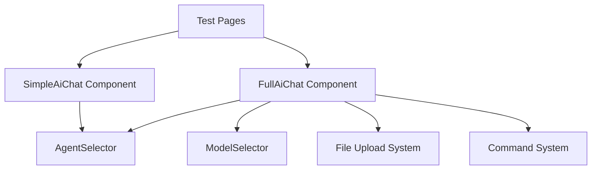

# Chat Components Testing Documentation

This document provides comprehensive documentation for the chat component test pages in the AI Portal application. These test pages are designed to validate and demonstrate the functionality of two different chat interfaces: a simplified chat component and a full-featured chat component.

## Overview

The testing suite consists of two main test pages:

1. **Chat Preview Test Page** (`/tests/chat-preview`) - Tests the [`SimpleAiChat`](components/research/SimpleAiChat.vue) component
2. **Chat Test Page** (`/tests/chat`) - Tests the [`FullAiChat`](components/research/FullAiChat.vue) component

Both pages provide interactive testing environments with comprehensive controls and real-time feedback for developers and QA teams.

## Test Pages

### 1. Chat Preview Test Page (`/tests/chat-preview`)

**File:** [`frontend/pages/tests/chat-preview.vue`](pages/tests/chat-preview.vue)

#### Purpose
This page tests the [`SimpleAiChat`](components/research/SimpleAiChat.vue) component, which provides a minimalist chat interface with animated placeholder text and basic interaction capabilities.

#### Features
- **View Toggle**: Switch between Simplified and Full view modes
- **Dynamic Text Configuration**: Customize static and preview text for animation testing
- **Real-time Preview**: See changes immediately as you modify settings
- **Interactive Demo Area**: Sample content to demonstrate chat positioning

#### Component Being Tested: SimpleAiChat

The [`SimpleAiChat`](components/research/SimpleAiChat.vue) component features:

- **Compact Design**: Small, fixed-position chat input (225px width, expands to 355px on focus)
- **Animated Placeholder**: 
  - Shows static text initially
  - After 5 seconds, starts typing/erasing animation with preview text
  - Animation stops when user focuses on input
- **Agent Mentions**: Type `@` to trigger agent suggestions with autocomplete
- **Responsive Behavior**: Hover effects and focus states
- **Navigation**: Submits to `/research/{randomUUID}` on form submission

#### Test Controls

| Control | Purpose | Default Value |
|---------|---------|---------------|
| **View Toggle** | Switch between Simplified/Full views | Simplified |
| **Static Text** | Text shown before animation starts | "Ask ChatGPT" |
| **Preview Text** | Text used for typing animation | "What can I help you with today?" |

#### Usage Instructions

1. **Access the page**: Navigate to `/tests/chat-preview`
2. **Configure text**: Modify static and preview text inputs to test different scenarios
3. **Test animation**: Wait 5 seconds to see the typing animation begin
4. **Test interaction**: 
   - Click on the chat input to stop animation
   - Type `@` followed by letters to test agent suggestions
   - Press Enter or click submit to test navigation
5. **Test responsiveness**: Hover over the chat to see expansion effects

#### Test Scenarios

- **Animation Testing**: Verify typing/erasing animation works correctly
- **Focus Behavior**: Ensure animation stops when input is focused
- **Agent Suggestions**: Test `@` mention functionality
- **Responsive Design**: Test hover and focus states
- **Navigation**: Verify form submission redirects correctly
- **Text Customization**: Test with different static and preview text lengths

### 2. Chat Test Page (`/tests/chat`)

**File:** [`frontend/pages/tests/chat.vue`](pages/tests/chat.vue)

#### Purpose
This page tests the [`FullAiChat`](components/research/FullAiChat.vue) component, which provides a comprehensive chat interface with advanced features like model selection, file uploads, and mode switching.

#### Features
- **Test Controls**: Toggle loading states and theme switching
- **Sample Data Display**: Shows available models, agents, and commands
- **Last Submission Tracking**: Displays details of the most recent form submission
- **Comprehensive Instructions**: Step-by-step testing guide
- **Real-time Feedback**: Console logging and visual feedback

#### Component Being Tested: FullAiChat

The [`FullAiChat`](components/research/FullAiChat.vue) component features:

- **Mode Selection**: Toggle between "Simple Search" and "Deep Exploration" modes
- **Model Selection**: Choose from 10 different AI models with descriptions and badges
- **Agent Mentions**: Type `@` to trigger agent suggestions with categories
- **Command System**: Type `/` to access available commands
- **File Upload**: Attach multiple files with format validation
- **Advanced Input**: Content-editable text area with paste handling and text cleaning
- **Loading States**: Visual feedback during processing
- **Keyboard Navigation**: Full keyboard support for all interactions

#### Test Controls

| Control | Purpose | Functionality |
|---------|---------|---------------|
| **Toggle Loading** | Test loading states | Simulates 2-second loading period |
| **Toggle Theme** | Switch light/dark themes | Adds/removes 'light' class from document |

#### Sample Data

The test page provides comprehensive sample data:

**Models (10 available):**
- Sonar (Perplexity's fast model)
- Claude Sonnet 4.0 (Anthropic's advanced model)
- Claude Sonnet 4.0 Thinking (Anthropic's reasoning model)
- Claude Opus 4.1 Thinking (with "макс" badge)
- Gemini 2.5 Pro (Google's latest model)
- GPT-5 (OpenAI's latest model)
- GPT-5 Thinking (OpenAI's latest model with thinking)
- o3 (OpenAI's reasoning model)
- o3-pro (with "макс" badge)
- Grok 4 (xAI's latest model)

**Agents (4 available):**
- @researcher (Expert in research and analysis)
- @coder (Programming and development specialist)
- @writer (Content creation and writing expert)
- @analyst (Data analysis and insights specialist)

**Commands (4 available):**
- /clear (Clear the current conversation)
- /help (Show available commands)
- /summarize (Summarize the conversation)
- /export (Export conversation to file)

#### Usage Instructions

1. **Access the page**: Navigate to `/tests/chat`
2. **Review sample data**: Check the available models, agents, and commands
3. **Test basic input**: Type text in the main input area
4. **Test agent mentions**: Type `@` followed by agent names
5. **Test commands**: Type `/` followed by command names
6. **Test mode switching**: Click between Simple Search and Deep Exploration
7. **Test model selection**: Click the CPU icon to select different models
8. **Test file upload**: Click the paperclip icon to attach files
9. **Test submission**: Press Enter or click submit button
10. **Monitor feedback**: Check the "Last Submission" section for results

#### Test Scenarios

**Basic Functionality:**
- Text input and editing
- Placeholder text display
- Form submission and reset

**Advanced Features:**
- Agent mention autocomplete and selection
- Command autocomplete and selection
- Mode switching between Simple/Deep
- Model selection with descriptions and badges
- File upload with multiple file support
- Loading state management

**Keyboard Navigation:**
- Tab navigation through all interactive elements
- Arrow key navigation in popups
- Enter key for selections
- Escape key to close popups

**Responsive Behavior:**
- Theme switching (light/dark)
- Hover states and transitions
- Focus management
- Popup positioning

## Technical Implementation Details

### Component Architecture



### Key Props and Configuration

#### SimpleAiChat Props
- `staticText` (String): Initial placeholder text
- `previewText` (String): Text for typing animation
- `agents` (Array): Available agents for mentions

#### FullAiChat Props
- `models` (Array): Available AI models
- `agents` (Array): Available agents for mentions
- `commands` (Array): Available slash commands
- `isLoading` (Boolean): Loading state indicator
- `placeholder` (String): Input placeholder text

### Event Handling

Both components emit a `submit` event with comprehensive data:

```javascript
// SimpleAiChat submission
{
  userInput: "cleaned text content",
  selectedAgents: [...], // Array of selected agents
  // Navigation to /research/{uuid}
}

// FullAiChat submission
{
  userInput: "cleaned text content",
  mode: "simple" | "deep",
  model: { id, name, description, badge? },
  files: [...] // Array of attached files
}
```

### Animation System (SimpleAiChat)

The [`SimpleAiChat`](components/research/SimpleAiChat.vue) component includes a sophisticated animation system:

- **Initial Delay**: 5 seconds before animation starts
- **Typing Speed**: 100ms per character
- **Erasing Speed**: 50ms per character
- **Pause After Typing**: 2 seconds
- **Pause After Erasing**: 1 second
- **Loop**: Continuous typing/erasing cycle until user interaction

### Text Processing (FullAiChat)

The [`FullAiChat`](components/research/FullAiChat.vue) component includes advanced text cleaning:

- HTML tag removal
- Markdown formatting cleanup
- Code block preservation
- Link text extraction
- Whitespace normalization
- Line break preservation

## Navigation and Access

### Development Server Access

When running the development server (`npm run dev`), access the test pages at:

- **Chat Preview**: `http://localhost:3000/tests/chat-preview`
- **Chat Test**: `http://localhost:3000/tests/chat`

### Page Metadata

Both test pages are configured with:
- **Layout**: Custom layout (chat-preview) or no layout (chat)
- **Title**: Descriptive page titles for browser tabs
- **Meta**: Appropriate meta tags for development

## Testing Checklist

### SimpleAiChat Component Testing

- [ ] Animation starts after 5-second delay
- [ ] Typing animation displays preview text correctly
- [ ] Erasing animation removes text character by character
- [ ] Animation stops when input is focused
- [ ] Agent suggestions appear when typing `@`
- [ ] Agent selection works with mouse and keyboard
- [ ] Form submission navigates to research page
- [ ] Hover effects work correctly
- [ ] Focus states are visually clear
- [ ] Component is responsive and positioned correctly

### FullAiChat Component Testing

- [ ] Text input accepts and displays user input
- [ ] Mode switching works between Simple/Deep
- [ ] Model selection displays all available models
- [ ] Agent mentions trigger popup with filtering
- [ ] Command system works with `/` prefix
- [ ] File upload accepts multiple files
- [ ] Loading states display correctly
- [ ] Form submission emits correct data structure
- [ ] Keyboard navigation works throughout
- [ ] Theme switching affects visual appearance
- [ ] Text cleaning processes pasted content correctly
- [ ] Popup positioning is accurate

## Troubleshooting

### Common Issues

1. **Animation not starting**: Check if `previewText` prop is provided and not empty
2. **Agent suggestions not appearing**: Verify agents array is properly formatted with required fields
3. **File upload not working**: Check file input ref and event handlers
4. **Theme switching ineffective**: Ensure CSS custom properties are properly defined
5. **Navigation failing**: Verify router is properly imported and configured

### Debug Information

Both test pages include comprehensive logging:
- Form submission data logged to console
- Component state changes tracked
- Error handling for edge cases
- Visual feedback for all user interactions

## Conclusion

These test pages provide comprehensive validation environments for both chat components, ensuring all features work correctly across different scenarios and use cases. Regular testing using these pages helps maintain component reliability and user experience quality.

For additional technical details, refer to the individual component source files and their inline documentation.