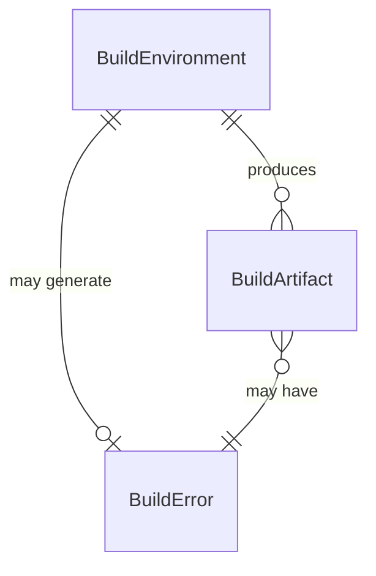

# Data Model: Fix Docker Build Failure

**Feature**: Fix Docker Build Failure
**Date**: 2026-01-01
**Status**: Draft

## Overview

This feature does not introduce new data entities or modify existing data structures. The build failure is a configuration issue, not a data modeling issue. However, for consistency with the SpecKit workflow, this document describes the entities involved in the build process from a conceptual standpoint.

## Entities

### BuildArtifact

Represents generated files from the build process.

**Attributes**:
- `type`: string - Artifact type (client-bundle, server-code, static-asset, manifest)
- `path`: string - File path relative to build output directory
- `size`: number - File size in bytes
- `hash`: string - Content hash for cache busting (if applicable)
- `status`: enum - (pending, generated, validated, failed)

**Examples**:
```javascript
// Client bundle
{
  type: "client-bundle",
  path: ".nuxt/dist/client/_nuxt/entry.js",
  size: 1054750,
  hash: "CyP9uHS4",
  status: "generated"
}

// Static asset
{
  type: "static-asset",
  path: ".nuxt/dist/client/_nuxt/logo.svg",
  size: 2048,
  hash: null,
  status: "generated"
}
```

### BuildError

Represents build failure information.

**Attributes**:
- `errorType`: string - Error category (configuration-error, compilation-error, runtime-error, dependency-error)
- `stage`: string - Build stage where error occurred (client-build, server-build, sw-generation)
- `file`: string - File path if error is file-specific
- `line`: number - Line number if applicable
- `message`: string - Human-readable error message
- `stackTrace`: string - Full error stack trace for debugging
- `suggestion`: string - Recommended fix (if available)

**Examples**:
```javascript
// PWA configuration error
{
  errorType: "configuration-error",
  stage: "sw-generation",
  file: "nuxt.config.js",
  line: 128,
  message: "When using networkTimeoutSeconds, you must set the handler to 'NetworkFirst'.",
  stackTrace: "Error: When using networkTimeoutSeconds...\n    at populateSWTemplate...",
  suggestion: "Remove networkTimeoutSeconds option or change handler to NetworkFirst"
}
```

### BuildEnvironment

Represents the build configuration and context.

**Attributes**:
- `nodeVersion`: string - Node.js version (e.g., "20.12.0")
- `environment`: enum - (development, production, test)
- `buildArgs`: object - Build-time environment variables
  - `STRAPI_URL`: string - Backend API URL
  - `PORT`: string - Application port
  - `NUXT_PUBLIC_YANDEX_METRIKA_ID`: string - Analytics ID
- `memoryLimit`: number - Available memory in MB (for Docker builds)
- `buildFlags`: array - Additional build flags and options

**Examples**:
```javascript
// Docker production build
{
  nodeVersion: "20.12.0",
  environment: "production",
  buildArgs: {
    STRAPI_URL: "https://strapi.example.com",
    PORT: "8080",
    NUXT_PUBLIC_YANDEX_METRIKA_ID: "12345678"
  },
  memoryLimit: 2048,
  buildFlags: ["--immutable", "--frozen-lockfile"]
}
```

## Relationships



**Relationship Descriptions**:

- **BuildEnvironment → BuildArtifact**: One-to-many
  - A single build environment can produce multiple build artifacts
  - Each artifact is generated within a specific build context

- **BuildEnvironment → BuildError**: One-to-one (optional)
  - A build environment may generate at most one build error (build stops at first error)
  - Not all build environments result in errors

- **BuildArtifact → BuildError**: Many-to-one (optional)
  - Multiple build artifacts may be associated with a single build error
  - Most build artifacts are not associated with errors (only failed artifacts)

## State Transitions

### Build Artifact Lifecycle

```
pending → generated → validated → deployed
                ↓
              failed
```

**States**:
- **pending**: Artifact is queued for generation
- **generated**: Artifact has been built successfully
- **validated**: Artifact has passed all validation checks
- **failed**: Artifact generation failed (error state)
- **deployed**: Artifact has been deployed to production

### Build Process States

```
initializing → installing-dependencies → building-client → building-server → generating-sw → complete
                                                    ↓              ↓           ↓
                                                  failed         failed      failed
```

**States**:
- **initializing**: Build environment setup
- **installing-dependencies**: Installing npm packages
- **building-client**: Compiling client-side bundles
- **building-server**: Compiling server-side code
- **generating-sw**: Generating PWA service worker
- **complete**: All stages finished successfully
- **failed**: Build stopped due to error

## Validation Rules

### BuildArtifact Validation

1. **File exists**: Artifact file must exist in the output directory
2. **Size > 0**: Artifact file must have non-zero size (except for empty placeholder files)
3. **Valid path**: Artifact path must be relative to build output directory
4. **Content hash**: For bundles, content hash must match expected value (if applicable)

### BuildEnvironment Validation

1. **Node version**: Must be compatible with project requirements (Node 20.x)
2. **Required build args**: `STRAPI_URL` must be provided and non-empty
3. **Memory limit**: Must be at least 1024MB for production builds
4. **Write permissions**: Build directory must be writable

### BuildError Validation

1. **Error type**: Must be one of the defined error type categories
2. **Stage**: Must be a valid build stage name
3. **Message**: Must be non-empty and descriptive
4. **File**: If provided, must be an existing file path in the project

## Data Flow

```
┌─────────────────┐
│ BuildEnvironment│
└────────┬────────┘
         │
         ├──> [yarn install]
         │    └──> Install dependencies
         │
         ├──> [yarn build]
         │    ├──> Client build stage
         │    │    └──> BuildArtifact (client bundles)
         │    │
         │    ├──> Server build stage
         │    │    └──> BuildArtifact (server code)
         │    │
         │    └──> SW generation stage
         │         ├──> Success → BuildArtifact (service worker)
         │         └──> Failure → BuildError
         │
         └──> [Build result]
              ├──> All artifacts generated → Success
              └──> BuildError → Failure
```

## Notes

### Not Applicable for This Feature

This data model is **conceptual only**. The Docker build failure fix does not require:

- New database tables or collections
- API endpoints for CRUD operations
- Data migration scripts
- State management changes

### Actual Changes Required

The fix requires only:

1. **Configuration change**: Remove `networkTimeoutSeconds` from [nuxt.config.js](../frontend/nuxt.config.js#L128)
2. **Testing**: Verify build completes successfully
3. **Deployment**: Deploy updated Docker image

No data structures, schemas, or models need to be created or modified.

### Future Considerations

If build monitoring or error tracking were to be implemented (User Story 2 from spec), these entities could become actual data structures in:

- A build monitoring system (e.g., CI/CD pipeline integration)
- An error tracking service (e.g., Sentry integration)
- A build analytics dashboard

For the current P1 fix (User Story 1), this conceptual model serves only to document the build process and error information for future reference.
